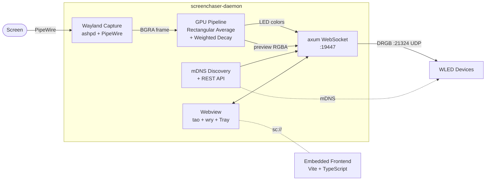

<picture>
  <source media="(prefers-color-scheme: dark)" srcset="https://github.com/user-attachments/assets/fd82d66e-7b48-482d-8d54-0afc678fbeda">
  <source media="(prefers-color-scheme: light)" srcset="https://github.com/user-attachments/assets/68ee7efc-abe7-4434-9705-45d8488a7ab1">
  
</picture>

<h1 align="left">ScreenChaser</h1>

<p align="center">
  
  
  
  <a href="https://discord.gg/g85QvUsyj9"></a>
</p>

## What is ScreenChaser

ScreenChaser is a Rust bias lighting daemon for Linux. It captures your screen through the Wayland XDG Desktop Portal, extracts zone colors on the GPU via wgpu compute shaders, and streams them to WLED devices over UDP. The embedded webview frontend lets you configure LED layouts, scan the network for devices, and watch a live preview — all from a single native binary.

It replaces the original Electron-based ScreenChaser with a ~5 MB binary that runs natively on Wayland, pulls only the hardware frames it needs through PipeWire, and offloads all per-pixel work to the GPU.

## Background

Bias lighting projects screen-derived colors behind the display to extend the image into its surroundings. The color extraction and temporal smoothing used here were developed and evaluated in my bachelor thesis, where test subjects rated video playback under different bias-light configurations and tended to prefer the bias-lit variants over the unlit reference.

## Features

- **Wayland-native capture** — XDG Desktop Portal + PipeWire stream, restore-token for dialog-free resume
- **GPU color extraction** — wgpu compute shaders, three passes (extract, average, downscale), headless on Vulkan
- **WLED UDP output** — DRGB realtime protocol on port 21324
- **mDNS discovery** — automatic WLED device detection on the LAN, name sync from REST API
- **Embedded frontend** — Vite + TypeScript, served from the binary through a custom `sc://` protocol
- **Live preview** — raw RGBA frames streamed over WebSocket, rendered to canvas in the UI
- **Tray icon** — Ayatana AppIndicator integration, window hides on close and restores on tray click
- **Per-device config** — parametric LED fields or custom positioned zones, enable/disable toggle, debounced persistence

## Requirements

- Linux with Wayland (tested on GNOME, KDE, Sway)
- Vulkan-capable GPU (AMD, Intel, NVIDIA)
- WLED device(s) on the local network, firmware 0.13+
- GNOME users: **AppIndicator and KStatusNotifierItem Support** extension for the tray icon

## Installation

One-liner via APT repository:

```bash
curl -fsSL https://xi72yow.github.io/ScreenChaser/install.sh | sudo bash
```

This imports the signing key, adds the APT source, and installs `screenchaser-daemon`.

Alternatively, grab the latest `.deb` from the [releases page](https://github.com/xi72yow/ScreenChaser/releases) and install with `sudo apt install ./screenchaser-daemon_*.deb`.

## Usage

Start the daemon:

```bash
screenchaser-daemon
```

On first run you will see the Wayland portal dialog asking which screen to capture. The daemon stores a restore-token in its config so subsequent starts skip the dialog.

Config lives at `~/.config/screenchaser/config.toml` and is written back automatically (debounced 2 s) whenever you change settings in the UI.

The webview window hides on close — the daemon keeps capturing and streaming. Bring it back via the tray icon or the "Quit ScreenChaser" menu item to shut down cleanly.

### Screenshots

<!-- TODO: add screenshots -->
<!--  -->
<!--  -->
<!--  -->

## Architecture


